# Full Snack Recipes

A link to the live project can be found here (https://full-snack-recipes.herokuapp.com/)

Full Snack Recipes is a site where users can come to view and create their favourite recipes.

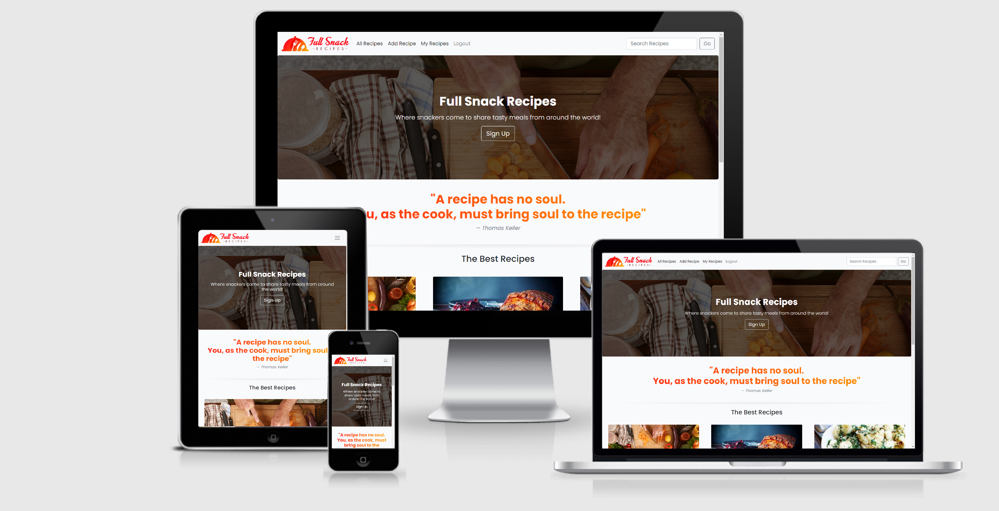

---
## User Experience (UX)

A user who would visit the site would immediately recognise what its intended use is. A guest can view all recipes that are created but are unable to comment on or create a recipe of their own. Once a user creates an account, they are able to create their own recipes, see them stored in their individual recipes page, and have the ability to update and delete them. As well as that, as a registered user, you can comment on and like other users recipes.

---
## User Stories - Completed

A list of my user stories and their tasks can be found [here](https://github.com/ChrisKellFSD/full-snack-recipes/issues).

- As a guest I can view recipes so that I don't need to make an account
- As a user I can register an account so that I can have my own profile of saved recipes
- As a user I can log out of my account so that I can have my session terminated
- As a user I can add recipes so that they are saved to my profile and the site for other users to view
- As a user I can edit my recipes so that I can update the information
- As a user I can delete my saved recipes
- As a user I can comment on recipes so that interact with fellow users
- As a User / Guest I can search recipes using various keywords so that I can find a recipe faster
- As a guest / user I can view the recipe site on any device without issue so that I have a better User Experience

## User Stories - Future implementation

These are user stories I would like to implement in the future.

- As a user I can click on 'Forgot Password' so that I can create a new password for my account
- As a user I can view other users profiles so that I can see the recipes they created
- As a user I can favorite recipes so that I can access them quickly
- As a user I can rate users recipes so that I can score their recipes

---
## Design

The look of this project is created from a combination of bootstrap class styling and the walkthrough 'I think therefore I blog project'. As well as that, I created a logo for Full Snack Recipes to help bring website branding to life.

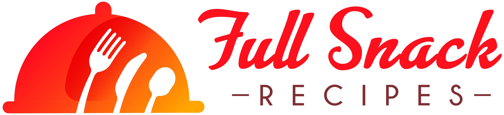

---
### Colour Scheme
- When you think of all the different recipes that are out there, you are not only shown vast ingredients and methods on how to make them, but are also shown beautiful imagery and stunning colours for each and every dish from around the world. I wanted my colour scheme to reflect that so I chose very bright gradients and colouring to help reflect this.

---
### Typography
- For the fonts, I chose to use Poppins as it is a widely used google font that is very neat and tidy. 

---
### Imagery
- The imagery I used was downloaded from [Freepik](www.freepik.com), the users can upload their own images and these will be hosted on Cloudinary

---
### Wireframes

Wireframes were done using Figma.
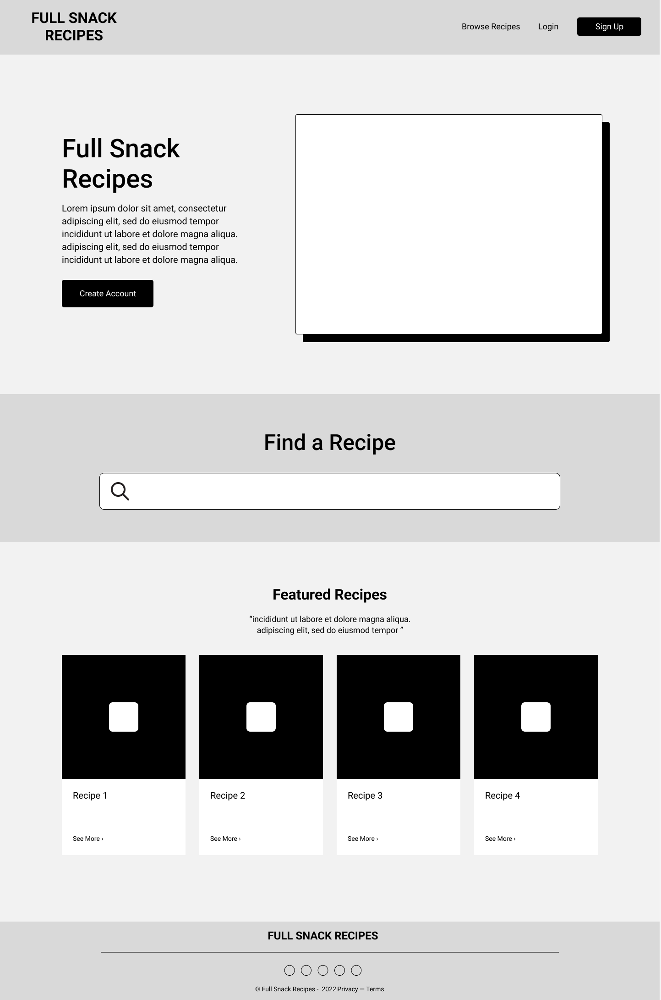
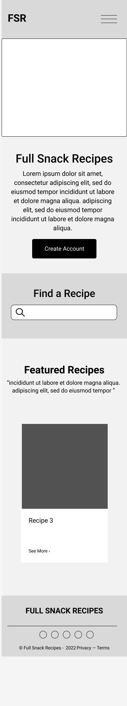

---
### Database Schema 
Please see the below Database Schema

## Features

### Home Page

- #### Navigation bar
    - The navigation bar will always show at the top of the page and will show user certain links depending on whether or not they are a registered user. If they are a guest, they will see the All Recipes, Register, Login and Search bar, whereas if they are logged in, they will see All Recipes, Add Recipe, My Recipes, Logout and the search bar

    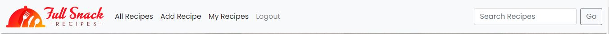

- #### Hero Image
    - The hero image was a taken from www.freepik.com and is presented as a slightly darkened imaged so the overlayed text will appear more legible. The text introduces the user to the website and what they can expect. As well as holding a sign up button that will lead the user to create an account if they have not done so already.

    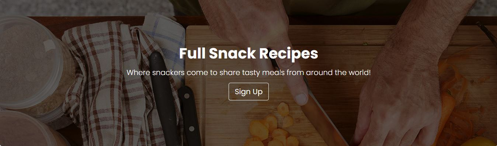

- #### Quotation
    - I used an existing famous recipe quotation and styled it using css gradients to make it more aesthetic for the user. This gradient represents the same colour scheme that was used in the Full Snack Recipe branding.

    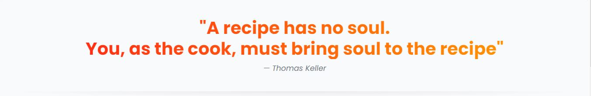

- #### Recipe Cards
    - The first set of recipe cards are diaplyed on the homepage. They work in tandem with a pagination featured that lets the user cycle through the various recipes. Only 6 recipes will appear on the page at any one time.
    - The cards design was done with keeping the colour scheme in mind so it all works together.

    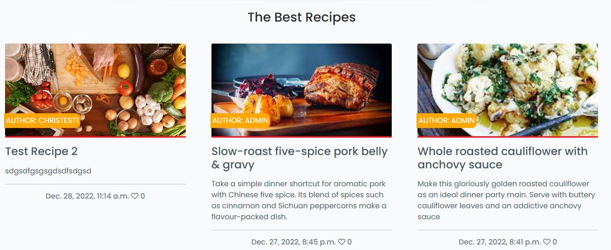

- #### Pagination
    - At the end of each card set, there is a pagination section that lets the user click through so that they can see the next or previous set of recipes.

    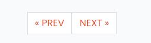

- #### Footer
    - The footers background is the same gradient used in the Full Snack Recipe logo and holds within it simple text and also social media buttons which all link to the respective social media website. Hovering over each icon will create a hover effect.

    

[Back to top ⇧](#eat-me)

### Accounts
- #### Register Page
    - The register page is used to create an account. It is based on the same register page in the django walkthough project.
    - A success message will appear once a user successfully registers.

    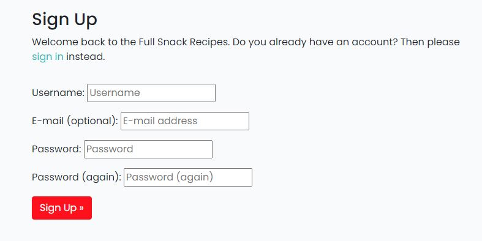

- #### Login Page
    - The login page is used to log in users with an existing account.
    - It is based on the same register page in the django walkthough project.
    - A success message will appear once a user successfully logs in.

    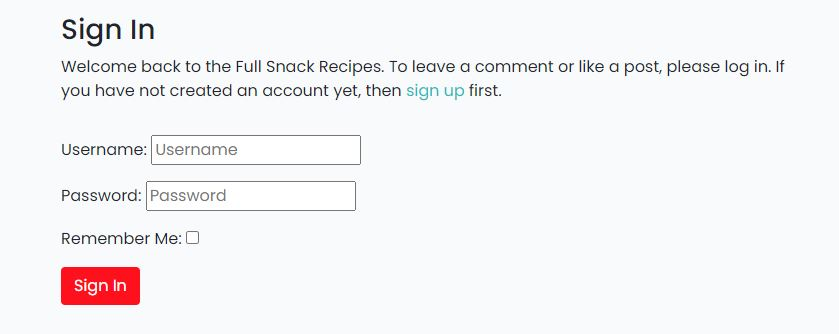

- #### Log out Page
    - The log out page is used to log out users who are signed in.
    - A success message will appear once a user successfully logs out.

    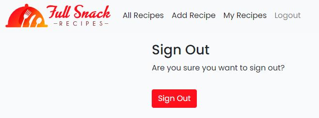

[Back to top ⇧](#full-snack-recipes)

### All Recipes Page

- #### Recipe Cards
    - The site will pagination to 6 recipes at any one time. Like the main homepage, there will be a pagination feature at the bottom to help the users navigate through the list of various recipes.

    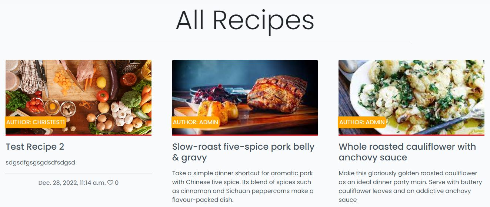

### My Recipes Page

- #### My Recipes
    - This page shows upto 6 recipes at anytime.
    - The pagination feature will show at the bottom of the page
    - There are two buttons to help the user either Edit or Delete a recipe

    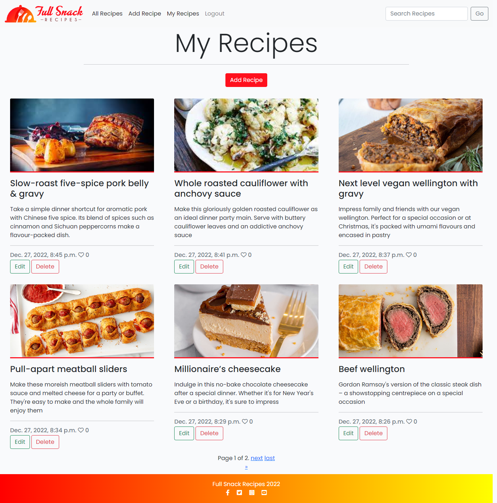

- #### Update Recipes
    - This page wil let the user update any recipes that they have created.

    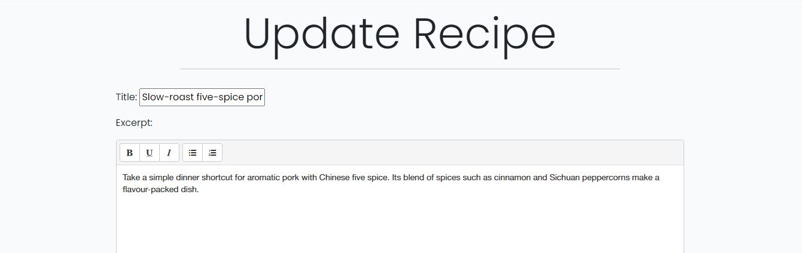

    - If the user tries to update a recipe that is not theirs, they will be be shown a forbidden message.

    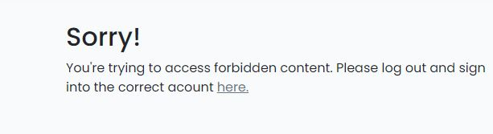

- #### Delete Recipes
    - When the user clicks on Delete, a modal box will appear so they can have another moment to think whether or not they want to action the deletion.
    - There are two ways to exit from this modal. You can either click on Close, or on the X symbol in the top right hand corner

    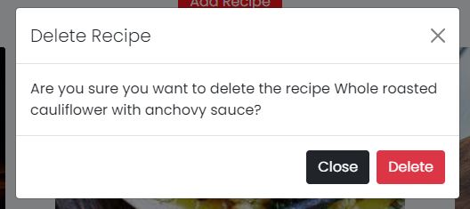

- #### No Recipes?
    - If the user clicks on the My Recipes link and they have no saved recipes, a message will be shown prompting them to create one!

    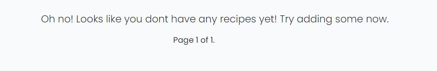

### Searched Recipes Page

- #### Searched Recipes
    - Anything entered into the search bar in the navigation bar displays results here. 

    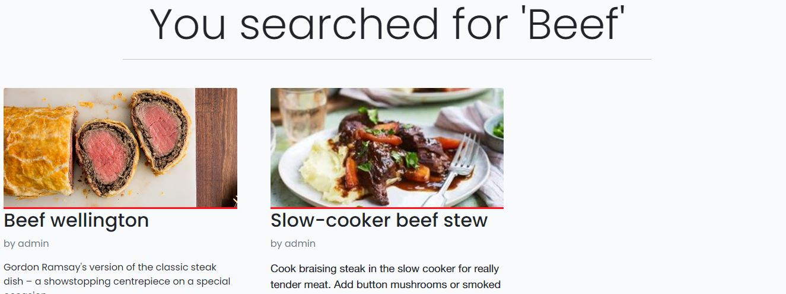

[Back to top ⇧](#full-snack-recipe)

### Recipe Detail Page

- #### Main Recipe Detail
    - This page will show the recipe title, author and time it was uploaded. As well as that it will show the users uploaded image (If they uploaded one, otherwise there is a placeholder recipe image)
    - The two main sections underneath are the ingredients and

    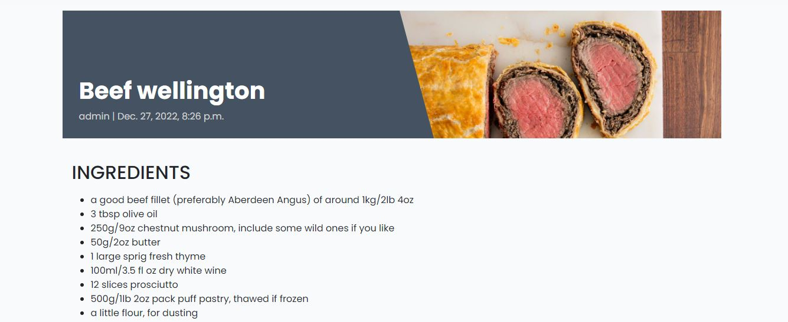
    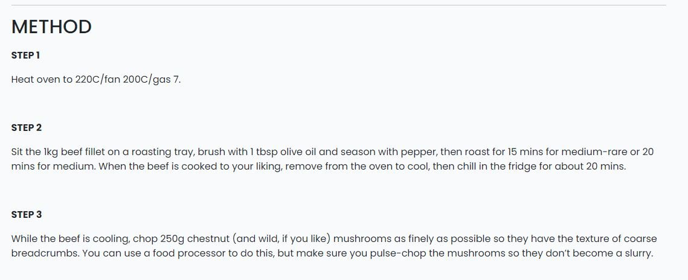

- #### Main Section
    - The main body of the page consists of the description, ingredients, and method. These combined is what creates the whole recipe.
    - At the bottom of the section is an icon and counter for both likes and comments.
    - Clicking the outlined heart renders the recipe 'liked' by the user which will then fill in the heart, add 1 to the counter, and add the recipe to the users favourite recipes page.
    - Alternatively, clicking a filled in heart renders the recipe 'unliked' which will then change the heart back to an outline, reduce the counter by 1 and remove the recipe from the user's favourite recipe page.

    

- #### Comments
    - At the bottom of the page is the comment section. Here you can view all comments left by users.
    - Only signed in users can leave a comment.
    - A success message appears once comments are left.
    - Once a comment is made, it will await approval from the admin until it shows up on the page.
    - Having the comment show up without approval, as well as the ability to edit or delete a comment you posted is a feature I would like to implement in the future.

    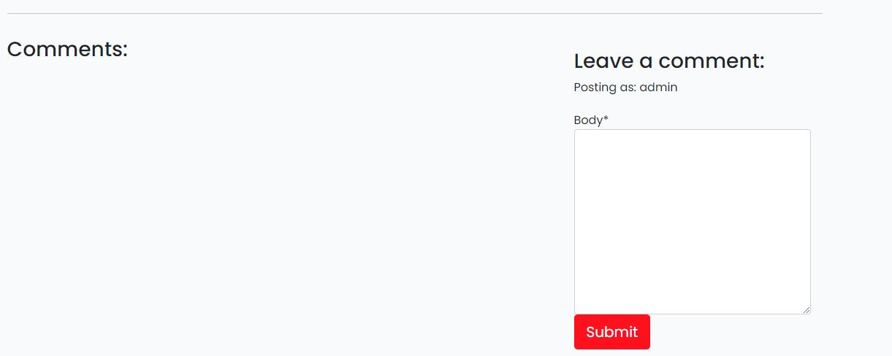
    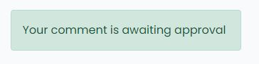

- #### Likes / Comments view
    - A user who is logged in has the ability to like a recipe. This will show up on the card for each recipe so each user can see how many likes it has received.
    - Having a favourite recipes page of recipes tha the user has liked is a feature to be implemented in the future
    - The total amount of comments will also show up at the end of each recipe like in the below image.

    

### Add Recipe Page

- #### Adding Recipes
    - The adding recipe page is where users upload their recipes
    - Each recipe is uploaded by filling out a form with various form fields.
    - You will need to fill out all form fields otherwise you will get an error message.
    - The user will then be presented with an option to upload a image of the recipe. This is optional and there is a placeholder image in place in the case that an image is not uploaded.
    - The user will need to click on published in the drop down menu in order for the recipe to show on the front end of the website.
    - I would have liked for the recipe to have gone straight to published but did create the database at the beginning with this option so knew it would create problems if I tried to change it.
    - An add Recipe button is present at the bottom of the page once the form is ready to send.
    - A cancel button is also available if the user wants to cancel making a recipe.
    - If a user tries to access this page without being signed in they will receive an error and a message will be shown showing a not logged in message.
    - A success message appears once a recipe is added successfully.  

    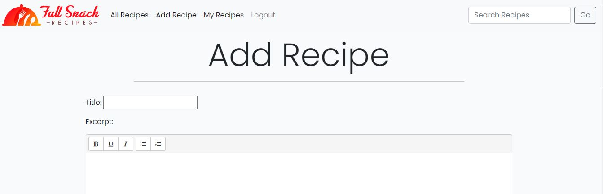

### Edit Recipe Page

- #### Editing Recipes
    - Editing a recipe brings up the form that was filled in when the recipe was created and has all the fields filled out with the original content.
    - Changing the content and hitting save at the bottom of the page saves the recipe.
    - A success message appears once a recipe is edited successfully.
    - If a user tries to access this page without being signed in they will receive a not logged in error.
    - If a user tries to edit a recipe that does not belong to them they receive a forbidden access error.

    

- #### Features to add
    - A rating system that would allow users to rate each recipe.
    - Add Vegan and Vegetarian tick boxes to recipes.
    - Option to share recipes on social media.
    - Email and forgot password authetication

[Back to top ⇧](#full-snack-recipe)

## Technologies

### Languages used

- [HTML5](https://en.wikipedia.org/wiki/HTML5)
- [CSS3](https://en.wikipedia.org/wiki/Cascading_Style_Sheets)
- [Javascript](https://en.wikipedia.org/wiki/JavaScript)
- [Python](https://www.python.org/)

---
### Libraries / Programs Used

- [Git](https://git-scm.com/)
    - Version control.
- [GitHub](https://github.com/)
    - For storing code and deploying the site.
- [Gitpod](https://www.gitpod.io/)
    - Used for building and editing my code.
- [Django](https://www.djangoproject.com/)
    - A python based framework that was used to develop the site.
- [Bootstrap](https://getbootstrap.com/)
    - For help designing the html templates.
- [Illustrator](https://adobe.com/)
    - For help designing the Full Snack Recipe logo.   
- [Google Fonts](https://fonts.google.com/)
    - Used to import the sites typography.
- [Font Awesome](https://fontawesome.com/)
    - Used to obtain the icons used.
- [Google Developer Tools](https://developers.google.com/web/tools/chrome-devtools)
    - Used to help fix problem areas and identify bugs.
- [Cloudinary](https://cloudinary.com/)
    - Used to store static files and images.
- [Favicon.io](https://favicon.io/)
    - Used to generate the site's favicon.
- [SQlite](https://www.sqlite.org/index.html)
    - Used when performing unit tests.
- [PostgreSQL](https://www.postgresql.org/)
    - Database used through heroku.
- [Figma](https://figma.com/)
    - To create the wireframes.
- [W3C Markup Validation Service](https://validator.w3.org/) 
    - Used to validate HTML code.
- [W3C CSS Validation Service](https://jigsaw.w3.org/css-validator/#validate_by_input)
    - Used to validate CSS code.
- [Pep8](http://pep8online.com/)
    - Used to validate Python code.
- [JSHint](https://jshint.com/)
    - Used to validate JS code.
- [Summernote](https://summernote.org/)
    - Used to add a WYSIWYG text box to the add recipe page.
- [Screen to Gif](https://www.screentogif.com/)
    - Used to create gifs for my readme.
- [Heroku](https://www.heroku.com/)
    - To deploy the project.

[Back to top ⇧](#full-snack-recipes)

---
## Testing 

Testing and results can be found [here](TESTING.md)

---
## Deployment

This project was deployed using Github and Heroku.

---
- ### Github 

    To create a new repository I took the following steps:

    1. Logged into Github.
    2. Clicked over to the ‘repositories’ section.
    3. Clicked the green ‘new’ button. This takes you to the create new repository page.
    4. Once there under ‘repository template’ I chose the code institute template from the dropdown menu.
    5. I input a repository name then clicked the green ‘create repository button’ at the bottom of the page.
    6. Once created I opened the new repository and clicked the green ‘Gitpod’ button to create a workspace in Gitpod for editing.

---
- ### Django and Heroku

    To get the Django framework installed and set up I followed the Code institutes [Django Blog cheatsheet](https://codeinstitute.s3.amazonaws.com/fst/Django%20Blog%20Cheat%20Sheet%20v1.pdf).

---   
- ### Forking

    To fork my project you must;
    1. Sign in to Github and go to my [repository](https://github.com/Delboy/Colour-Type)
    2. Locate the Fork button at the top right of the page.
    3. Select this. 
    4. The fork is now in your repositories.

---
- ### Clone
    To clone my project you must;

    1. Sign in to Github and go to my [repository](https://github.com/Delboy/eatme)
    2. Above the list of files click the green ‘code’ button.
    3. This will bring up a few options as to how you would like to clone. You can select HTTPS, SSH or Github CLI, then click the clipboard icon to copy the URL.
    4. Open git bash
    5. Type ‘git clone’ and then paste the URL you copied. Press Enter.

    For more information on cloning check out the github documentation [here](https://docs.github.com/en/repositories/creating-and-managing-repositories/cloning-a-repository)

---
## Credits

---
### Code

 -  I learnt how to change the form's field's label in this thread [stackoverflow.com](https://stackoverflow.com/questions/636905/django-form-set-label).

 - I learnt how to reflect the active page in the navbar here on [tekshinobi.com](https://tekshinobi.com/setting-active-navbar-link-in-django-template/).

 - I used this page to help me write unit tests for my admin functions [Google Groups](https://groups.google.com/g/django-users/c/2zN3BlFLIFE).

---
 ### Media

 - The hero image was taken from [coop.co.uk](https://www.coop.co.uk/recipes/earl-grey-poached-pears-with-ice-cream).
 - All other food images were taken from [bbc.co.uk/food](https://www.bbc.co.uk/food).

---
 ### Other

 - [The code insitutes](https://codeinstitute.net/) 'I think therefore I blog' project which inspired the overall feel of the paginated and recipe detail pages.
 - The [Django documentation](https://docs.djangoproject.com/en/4.0/) which was instrumental in helping me solve problems.