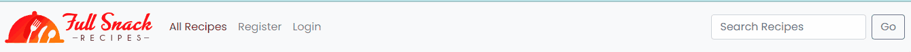
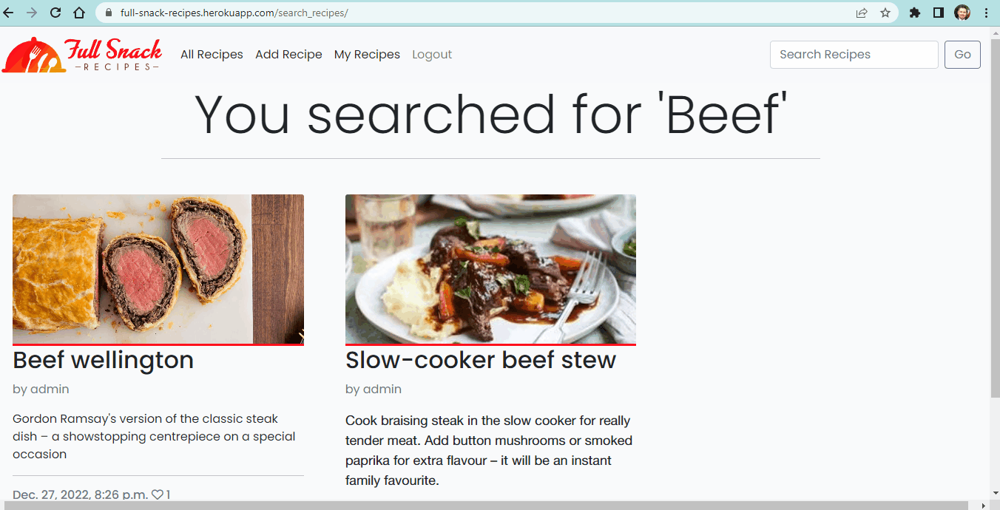

# Full Snack Recipes - Testing

## Contents 

- [Validators](#validators)
- [User story testing](#user-story-testing)
- [Automated Testing](#automated-testing)
- [Manual Testing](#manual-testing)

## Validators
- HTML
    - I ran the website through [w3c](https://validator.w3.org/nu/?doc=https%3A%2F%2Ffull-snack-recipes.herokuapp.com%2F) and no errors were reported.
    

- CSS 
     - No errors were found when passing through the official [(Jigsaw) validator](https://jigsaw.w3.org/css-validator/validator?uri=https%3A%2F%2Ffull-snack-recipes.herokuapp.com%2F&profile=css3svg&usermedium=all&warning=1&vextwarning=&lang=en)

     

- JavaScript
    - No errors were found when passing through [Jshint](https://jshint.com/)

    

- Python
    - No errors were found when passing through [Python Checker](https://www.pythonchecker.com/)
    
    - Note, I went to use Pep8online checker but the domain was not live at the time of checking.
    

- Lighthouse

    

## User Story Testing

*As a guest I can view recipes so that I don't need to make an account*
- Any guest user who does not have an account can click on the 'All Recipes' link and also use the search bar in the top right hand corner to search for recipes.

*As a user I can register an account so that I can have my own profile of saved recipes*
- A guest user will have two ways to register an account and will be prompted to do so by the 'Register' button in the Navigation bar and also the Sign Up button on the hero image

*As a user I can log out of my account so that I can have my session terminated*
- At anytime, a user can go to the navigation bar and log out of a session. A  message will then appear to reiterate that this has been done successfully

*As a user I can add recipes so that they are saved to my profile and the site for other users to view*
- When a registered user creates a recipe. They can click on the 'My Recipes' link in the navigation bar to view their created recipes. If they click on this link and there are no recipes created, they will be prompted to do so with a message.

*As a user I can edit my recipes so that I can update the information*
- When a registered user creates a recipe. They can click on the 'My Recipes' link in the navigation bar to view their created recipes. They will see two buttons at the end of each of their created recipe card; Edit and Delete. If they click on the Edit button, they will be brought to a page that they can update the recipe information on.

*As a user I can delete my saved recipes*
- When a registered user creates a recipe. They can click on the 'My Recipes' link in the navigation bar to view their created recipes. They will see two buttons at the end of each of their created recipe card; Edit and Delete. If they click on the Delete button, a modal box will appear, giving them the option to delete or they can close the modal box and return to the page.

*As a user I can comment on recipes so that interact with fellow users*
- Once a user is logged in, they can leave a comment on any recipe. These comments will first need to be approved by the admin before they are live on the site.

*As a User / Guest I can search recipes using various keywords so that I can find a recipe faster*
- A user / guest can use the search bar to search for the title of a recipe.

*As a guest / user I can view the recipe site on any device without issue so that I have a better User Experience*
- AThe website is responsive across all platforms; Desktop - laptop - ipad - mobile device

[Back to top ⇧](#full snack recipes ---testing)

## Automated testing

I created 3 test files to test my python code across my forms, views and model files.

## Manual Testing

- #### Navigation bar
    - Checked that all links worked correctly and were directing the user to the correct page

    

- #### Hero Image / Register
    - Checked that the link on the hero image linked to the register page.
    - Checked the user could Register
    - Checked to see that the text on the hero iamge updated to show which user was logged in

    

- #### Footer
    - Checked that all links worked on the footer.

    

- #### Recipe Detail / Comments
    - Checked that when you clicked on a recipe on the home page, you were directed to teh correct page and could leave a comment on that recipe.

    

- #### Add Recipe
    - Checked that you could add a recipe and all the relevant form fields were correctly showing.
    - The user will need to mark a recipe as Published in order for it to be viewed on the page.

    

- #### Update Recipe
    - Checked that you could update any of your created recipes

    

- #### Delete Recipe
    - Checked that you could delete any of your created recipes

    

- #### Search Recipe
    - Checked that you could search for recipes. If the title had a word you searched for you would see those recipes
    - If your search yielded no results, you would see a message on the screen prompting you to try again

    
    

- #### Not my Recipes
    - Checked to see what would be on screen if you clicked on My recipes but there are none present
    - The user will then be prompted to add a recipe.

    

- #### Logout
    - Checked to see that a user could correctly log out.

    
